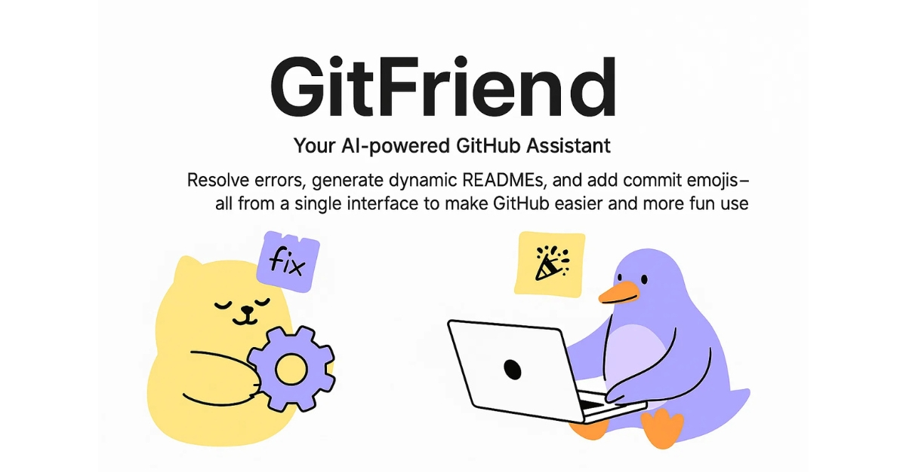

# Git-Friend 

  

<!-- 

  

 -->

  

Welcome to GitFriend! 🎉
Your AI-powered GitHub assistant, designed to make managing your repositories easier and more efficient than ever before.

## About 📚

### About GitFriend 📚  
GitFriend is a cutting-edge tool built with React, TypeScript, and AI technology to enhance your GitHub experience. Whether you're a developer, project manager, or beginner, GitFriend helps you navigate GitHub with ease, offering features that save you time and improve productivity.

With GitFriend, you can access a variety of powerful tools right at your fingertips:  
- **AI Chat for GitHub Help**: Encountering issues or need guidance? Chat with GitFriend's AI to resolve errors or learn Git and GitHub concepts quickly.  
- **Dynamic README Generation**: Automatically generate customized README files for your repositories with just a few clicks.  
- **Commit Emojis**: Add fun and meaningful emojis to your Git commits to improve readability and make your commit history stand out.

GitFriend simplifies your GitHub workflows and allows you to focus on what matters most: your projects.

## Current Features 🚀

- **Google Authentication**: Securely log in using your Google account to access all features.
- **AI Chat Integration**: Get assistance with Git commands, project setup, and more through our integrated AI chat.
- **README Generation**: Automatically generate professional READMEs for your projects with customizable templates.
- **Gitmoji Support**: Easily add expressive emojis to your commit messages following the Gitmoji convention.
- **User-friendly Interface**: Intuitive UI that makes navigation and usage a breeze.
- **React Components**: Utilizes various React components for interactive and responsive user experience.

<!-- 
<a href="https://www.star-history.com/#krishn404/Git-Friend&Timeline">
 <picture>
   <source media="(prefers-color-scheme: dark)" srcset="https://api.star-history.com/svg?repos=krishn404/Git-Friend&type=Timeline&theme=dark" />
   <source media="(prefers-color-scheme: light)" srcset="https://api.star-history.com/svg?repos=krishn404/Git-Friend&type=Timeline" />
   
 </picture>
</a> -->

## Tech Stack 💻

- **Programming Languages**: TypeScript, CSS, JavaScript
- **Frameworks/Libraries**: React, Next.js, Octokit, Radix UI, Firebase, TailwindCSS
- **Development Tools**: Node, npm, TypeScript
- **AI Integration**: Groq

## User flow

### Login
1. Navigate to the homepage and click on "Login with Google"
2. Complete the Google authentication flow
3. You'll be redirected to the dashboard upon successful login

### Using the README Generator
1. From the dashboard, select "README Generator"
2. Enter your project details (name, description, tech stack)
3. Customize the sections you want to include
4. Click "Generate README"
5. Preview the generated README and make any needed adjustments
6. Download the README or copy to clipboard

### Using the AI Chat
1. Navigate to the "AI Chat" section
2. Type your question about Git or GitHub
3. Receive instant AI-powered assistance

### Using Gitmoji
1. Go to the "Gitmoji" section from the dashboard
2. Browse through available emojis categorized by commit type
3. Click on an emoji to copy the corresponding code
4. Use in your commit messages for semantic versioning

## Use Cases 📋

### For Open Source Contributors
Use Git-Friend to quickly generate professional READMEs for your open source projects, making them more accessible to potential contributors.

### For Team Leads
Maintain consistency across your team's repositories by using standardized README templates and commit message practices with Gitmoji.

### For GitHub Beginners
Get assistance with Git commands and best practices through the AI chat feature.

### For Documentation Teams
Streamline the process of creating and updating documentation with AI-powered README generation and formatting.
